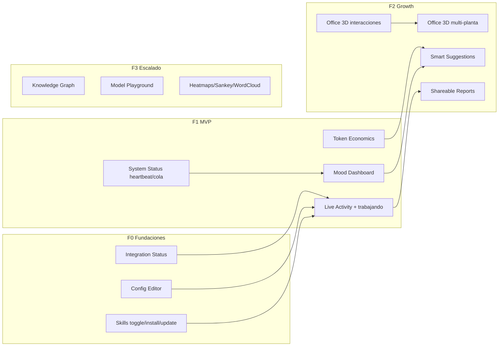

# Mission Control — Roadmap v2 (Plan ejecutable)

Este documento es el **plan de trabajo pendiente** reorganizado por impacto y ejecutividad. Lo ya implementado se documenta en [ROADMAP.md](./ROADMAP.md).

---

## 0. Todo list (checklist ejecutable)

Una sola lista para marcar progreso. Orden: F0 → F1 → Quick wins → F2 → F3.

### F0 — Fundaciones

- [x] Integration Status: lista de integraciones con estado (conectado/error/última actividad)
- [x] Integration Status: botón "Test" por integración
- [x] Integration Status: flujo de reautenticación cuando falle el test
- [x] Config Editor: vista read-only de config con valores sensibles enmascarados
- [x] Config Editor: editar keys en allowlist con validación
- [x] Config Editor: aplicar cambios y reiniciar gateway si aplica
- [x] Skills: toggle activar/desactivar un skill desde la UI
- [x] Skills: instalar skill desde ClawHub
- [x] Skills: actualizar skill instalado

### F1 — MVP

- [x] Live Activity: activity feed en tiempo real en Dashboard
- [x] Live Activity: indicador "Tenacitas está trabajando"
- [x] Live Activity: toasts de notificaciones
- [x] System Status: vista con último heartbeat del agente
- [x] System Status: cola de tareas pendientes
- [x] System Status: CPU/memoria del VPS (vista dedicada)
- [x] Token Economics: vista de consumo por modelo (Opus, Sonnet, Haiku, etc.)
- [x] Token Economics: breakdown input/output/cache y comparativas (hoy/ayer, semana)
- [x] Token Economics: proyección mensual, top 5 tareas, efficiency score
- [x] Mood Dashboard: widget estado (productivo, ocupado, idle, frustrado)
- [x] Mood Dashboard: streak días sin errores críticos, energy (tokens/hora), emoji animado

### Quick wins (1–3 días cada uno)

- [x] Config Viewer read-only con máscara de sensibles
- [x] Indicador "Tenacitas está trabajando" en header o dashboard
- [x] Integration Status: lista + estado + botón Test por integración
- [x] Toggle activar/desactivar skill
- [x] Vista mínima System Status: último heartbeat + tamaño de cola

### F2 — Growth

- [ ] Office 3D: sub-agents como visitantes en la oficina
- [ ] Office 3D: trail visual parent ↔ sub-agent
- [ ] Office 3D: efectos (partículas success, humo error, beam heartbeat)
- [ ] Office 3D: sonido ambiental toggleable (teclas, notificaciones, lofi)
- [ ] Office 3D: 4 plantas navegables con ascensor (Main Office, Server Room, Archive, Control Tower)
- [ ] Office 3D: temas (modern, retro, cyberpunk, matrix) y modos (Focus, God, Cinematic)
- [ ] Smart Suggestions: analizar patrones y sugerir optimizaciones (modelo, cron, heartbeats, horarios)
- [ ] Smart Suggestions: tarjetas con Apply/Dismiss y aprender de dismissals
- [ ] Shareable Reports: report semanal/mensual, export PDF, link público read-only, rangos de fecha

### F3 — Escalado

- [ ] Knowledge Graph Viewer: grafo de conceptos/entidades, click→snippets, clustering, búsqueda visual, export imagen
- [ ] Model Playground: input prompt, comparar modelos lado a lado, tokens/coste/tiempo, guardar y share
- [ ] 3D Workspace Explorer: árbol de archivos en 3D (tamaño/color por tipo), click→preview/edit
- [ ] Heatmaps: grid 24x7 actividad, hover detalles, click→filtrar feed, export imagen
- [ ] Sankey: flujos tokens (input→cache→output), tareas (type→status), tiempo (hora→actividad→resultado)
- [ ] Word Cloud memories: palabras frecuentes en MEMORY.md, click→buscar, animación hover
- [ ] Team Dashboard (futuro): multi-user, actividad otros agentes, comparar performance, shared memory bank

---

## 1. Resumen ejecutivo

**Qué se construye:** Un panel de control (Mission Control) para operar y observar el agente OpenClaw/Tenacitas: configuración, integraciones, skills, estado en tiempo real, consumo de tokens, oficina 3D y visualizaciones avanzadas del conocimiento y la actividad.

**Para quién:** El operador o administrador del agente (una persona o equipo que mantiene, configura y optimiza la instancia de OpenClaw).

**Éxito significa:** (1) Poder activar/desactivar e instalar/actualizar skills sin tocar código. (2) Ver y probar el estado de las integraciones (Twitter, Gmail, etc.) y reautenticar cuando falle. (3) Ver y editar la configuración de OpenClaw de forma segura y con validación. (4) Tener visibilidad en tiempo real de la actividad del agente y del estado del sistema (heartbeat, cola, recursos). (5) Entender y optimizar el gasto en tokens y el “estado” del agente (mood, sugerencias). (6) Opcional: experiencia “wow” con Office 3D multi-planta, Knowledge Graph y visualizaciones avanzadas, y en el futuro colaboración multi-usuario.

---

## 2. Suposiciones y alcance

### Entra en alcance (MVP y post-MVP)

| Área | MVP | Post-MVP |
|------|-----|----------|
| **Config** | Skills (toggle, instalar desde ClawHub, actualizar), Integration Status (estado, última actividad, test, reauth), Config Editor (ver, editar valores seguros, validar, reiniciar gateway) | — |
| **Real-time** | Activity feed en tiempo real, indicador “Tenacitas está trabajando”, toasts; heartbeat, CPU/memoria VPS, cola de tareas | — |
| **Office 3D** | Sub-agents como visitantes, trail parent↔sub-agent, efectos (partículas, humo, beam), sonido ambiental toggleable | Multi-planta (4 plantas + ascensor), temas y modos (Focus, God, Cinematic) |
| **Agent Intelligence** | Mood dashboard (estado, streak, energy, emoji), Token Economics (vista detallada, breakdown, comparativas, proyección, top 5 tareas, efficiency score) | Knowledge Graph Viewer, Model Playground, Smart Suggestions Engine |
| **Visualizaciones** | — | 3D Workspace Explorer, Heatmaps, Sankey, Word Cloud memories |
| **Collaboration** | — | Shareable reports (PDF, link público), Team Dashboard (multi-user, actividad otros agentes, shared memory) |
| **Métricas de rendimiento** | (Referenciado en prioridad; si no está en ROADMAP base, se considera parte de “System Status” / observabilidad) | Vista dedicada performance (tiempo, uptime) si se desdobla |

### No entra (explícitamente fuera)

- Cambios en el núcleo de OpenClaw que no sean hooks/APIs ya acordados.
- Backoffice de ClawHub (gestión pública de skills); solo “instalar desde ClawHub” en este panel.
- Billing/pagos de infra o de APIs (solo visualización de coste de tokens).
- Mobile app o cliente nativo; scope es web (Mission Control).

---

## 3. Ejes de producto

Agrupación por dominios para priorizar y planificar.

| Eje | Incluye (pendiente) |
|-----|----------------------|
| **Config / Skills** | Activar/desactivar skills, instalar desde ClawHub, actualizar skills |
| **Integraciones** | Estado de conexiones (Twitter, Gmail, etc.), última actividad, test de conectividad, reautenticar |
| **Config Editor** | Ver config OpenClaw, editar valores seguros, validación, reiniciar gateway si aplica |
| **Real-time / Activity** | Activity feed en tiempo real, “Tenacitas está trabajando”, toasts; heartbeat, CPU/memoria VPS, cola de tareas |
| **Office 3D** | Sub-agents visitantes, trail parent↔sub-agent, efectos y sonido; multi-planta, temas, modos |
| **Agent Intelligence** | Mood dashboard, Token Economics, Knowledge Graph, Model Playground, Smart Suggestions |
| **Visualizaciones avanzadas** | 3D Workspace Explorer, Heatmaps, Sankey, Word Cloud memories |
| **Collaboration** | Shareable reports, Team Dashboard (multi-user) |
| **Infra / Observabilidad** | System status (heartbeat, recursos, cola); métricas de rendimiento si se desdoblan |

---

## 4. Fases por impacto

### F0 — Fundaciones (bloqueantes)

Sin esto, el resto no es operativo o es frágil.

| Ítem | Objetivo | Alcance | Dependencias | Esfuerzo | Riesgo | Criterio de aceptación |
|------|----------|---------|--------------|----------|--------|-------------------------|
| **Integration Status** | Saber si las integraciones funcionan y poder reaccionar | Estado por integración, última actividad, test de conectividad, reautenticar si necesario | API/backend que exponga estado y acciones de reauth | M | M | Operador ve estado por integración y puede ejecutar test y reauth desde la UI |
| **Config Editor (seguro)** | Cambiar config de OpenClaw sin editar archivos a mano | Ver config actual, editar valores en allowlist, validación antes de guardar, reiniciar gateway si necesario | Allowlist de keys editables, API de config, posible reinicio gateway | M | A | Operador edita solo keys permitidas; cambios se validan y aplican (con reinicio si aplica) |
| **Skills: toggle + instalar + actualizar** | Gestionar skills desde la UI | Activar/desactivar, instalar desde ClawHub, actualizar skills | API ClawHub/install/update y convención de “skill enabled” | M | M | Operador activa/desactiva, instala y actualiza skills sin tocar filesystem |

**Interpretación elegida:** “Reiniciar gateway si necesario” se considera parte del Config Editor: solo cuando la config lo requiera (p. ej. cambios que el gateway no recarga en caliente). No se asume reinicio automático en cada edición.

---

### F1 — MVP (valor mínimo real)

Lo que da valor operativo día a día.

| Ítem | Objetivo | Alcance | Dependencias | Esfuerzo | Riesgo | Criterio de aceptación |
|------|----------|---------|--------------|----------|--------|-------------------------|
| **Live Activity + “está trabajando”** | Visibilidad en tiempo real de la actividad | Integración en Dashboard/Activity feed en tiempo real, indicador “Tenacitas está trabajando”, toasts | SSE o similar ya existente para actividades | S | B | Usuario ve actividad en vivo y un indicador claro de “trabajando” |
| **System Status (heartbeat + cola)** | Saber si el agente está vivo y qué tiene pendiente | Heartbeat del agente (vista dedicada), cola de tareas pendientes | Backend que exponga heartbeat y cola | M | M | Operador ve si el agente está vivo y cuántas tareas hay en cola |
| **System Status (recursos VPS)** | Evitar sorpresas de recursos | CPU/memoria del VPS (vista dedicada) | Endpoint o agente que reporte métricas del host | S | B | Operador ve CPU y memoria del VPS en una vista dedicada |
| **Token Economics** | Control de coste y optimización | Vista por modelo, breakdown input/output/cache, comparativas (hoy/ayer, semana), proyección mensual, top 5 tareas, efficiency score | Datos de uso de tokens ya existentes o a integrar | L | M | Operador ve consumo por modelo, tendencias y proyección y puede identificar tareas costosas |
| **Mood Dashboard** | Lectura rápida del “estado” del agente | Widget estado de ánimo (productivo, ocupado, idle, frustrado), streak sin errores críticos, energy (tokens/hora), emoji animado | Métricas de actividad y errores | M | B | Operador ve en un vistazo el “mood” y un indicador de racha/energy |

---

### F2 — Growth (retención / engagement)

Mejora la experiencia y el “wow” sin ser bloqueante.

| Ítem | Objetivo | Alcance | Dependencias | Esfuerzo | Riesgo | Criterio de aceptación |
|------|----------|---------|--------------|----------|--------|-------------------------|
| **Office 3D: interacciones y ambient** | Oficina más viva y comprensible | Sub-agents como visitantes, trail parent↔sub-agent, efectos (partículas success, humo error, beam heartbeat), sonido ambiental (teclas, notificaciones, lofi) toggleable | Office 3D actual (8.1–8.2) | M | M | Sub-agents visibles, trail y efectos funcionando, sonido opcional |
| **Office 3D: multi-planta** | Navegación por “pisos” temáticos | 4 plantas (Main Office, Server Room, Archive, Control Tower) con ascensor; temas (modern, retro, cyberpunk, matrix); modos Focus, God, Cinematic | Office 3D F2 anterior | L | M | Usuario cambia de planta, elige tema y modo |
| **Smart Suggestions Engine** | Que el sistema sugiera mejoras | Analizar patrones, sugerir optimizaciones (modelo, cron, heartbeats, horarios), tarjetas con Apply/Dismiss, aprender de dismissals | Datos de actividad, cron, tokens | L | A | Operador ve sugerencias accionables y puede aplicar o descartar; los descartes influyen en futuras sugerencias |
| **Shareable Reports** | Compartir resumen de actividad | Report semanal/mensual, export PDF, link público read-only, rangos de fecha custom | Activity/analytics existentes | M | B | Operador genera un report y lo comparte por link o PDF |

---

### F3 — Escalado (rendimiento, observabilidad, compliance)

Observabilidad avanzada, escalado y preparación para equipo.

| Ítem | Objetivo | Alcance | Dependencias | Esfuerzo | Riesgo | Criterio de aceptación |
|------|----------|---------|--------------|----------|--------|-------------------------|
| **Knowledge Graph Viewer** | Explorar el conocimiento del agente | Grafo de conceptos/entidades (MEMORY.md, brain), nodos y links, click→snippets, clustering, búsqueda visual, export imagen | Estructura de memoria/brain accesible | L | M | Operador navega el grafo y obtiene contexto por nodo |
| **Model Playground** | Comparar modelos y coste/tiempo | Input prompt, varios modelos, respuestas lado a lado, tokens/coste/tiempo por modelo, guardar experimentos, share (copy link) | APIs de modelos o gateway unificado | M | M | Operador compara modelos con el mismo prompt y ve coste/tiempo |
| **3D Workspace Explorer** | Ver el árbol de archivos en 3D | Nodos = archivos (tamaño), color = tipo, navegación con mouse, click → preview/edit | File browser / workspace APIs | L | M | Usuario explora el árbol en 3D y abre archivos desde ahí |
| **Heatmaps interactivos** | Actividad por tiempo | Grid 24x7, hover con detalles, click → filtrar activity feed, export imagen | Activity feed con timestamps | M | B | Operador ve calor de actividad por hora/día y puede filtrar |
| **Sankey Diagrams** | Flujos de tokens, tareas y tiempo | Flujos: tokens (input→cache→output), tareas (type→status), tiempo (hora→actividad→resultado) | Datos ya existentes de tokens y actividades | M | B | Operador ve al menos un flujo Sankey útil (p. ej. tokens o tareas) |
| **Word Cloud memories** | Resumen visual de MEMORY | Palabras frecuentes en MEMORY.md, tamaño = frecuencia, click → buscar en memories, animación hover | Acceso a MEMORY.md / memories | S | B | Operador ve nube de palabras y puede profundizar en una |
| **Team Dashboard (futuro)** | Multi-usuario y comparación | Multi-user, actividad de otros agentes, comparar performance, shared memory bank | Auth multi-usuario, modelo de “equipo” | L | A | (Futuro) Varios usuarios ven sus agentes y comparten memoria |

---

## 5. Backlog saneado

### Duplicados detectados

- **Test de conectividad** y **Integration Status** son el mismo ámbito: el “test” es una acción dentro de Integration Status. Se deja un solo ítem: “Integration Status (estado, última actividad, test, reauth)”.
- **Reiniciar gateway** aparece solo en Config Editor; no se duplica.

### Items vagos reescritos (formato usuario/acción/beneficio)

| Original | Reescrito |
|----------|-----------|
| Activar/desactivar skills | Como **operador** quiero **activar o desactivar un skill** para **no tener que tocar código o archivos**. |
| Instalar desde ClawHub | Como **operador** quiero **instalar un skill desde ClawHub** para **añadir capacidades sin clonar repos a mano**. |
| Actualizar skills | Como **operador** quiero **actualizar un skill instalado** para **tener correcciones y nuevas funciones**. |
| Estado de conexiones (Twitter, Gmail…) | Como **operador** quiero **ver el estado de cada integración (conectada/error/última actividad)** para **saber si debo reautenticar o depurar**. |
| Test de conectividad | Como **operador** quiero **ejecutar un test de conectividad por integración** para **verificar que las credenciales siguen válidas**. |
| Ver configuración actual de OpenClaw | Como **operador** quiero **ver la configuración actual de OpenClaw** para **revisar qué está activo sin abrir archivos**. |
| Editar valores seguros | Como **operador** quiero **editar solo las claves permitidas de la config** para **cambiar comportamiento sin riesgo de romper keys sensibles**. |
| Integración en Dashboard/Activity feed en tiempo real | Como **operador** quiero **ver el activity feed en tiempo real en el Dashboard** para **seguir lo que hace el agente sin refrescar**. |
| Indicador "Tenacitas está trabajando..." | Como **operador** quiero **ver un indicador claro cuando el agente está trabajando** para **saber que no está colgado**. |
| Heartbeat del agente | Como **operador** quiero **ver un heartbeat del agente** para **confirmar que el proceso está vivo**. |
| Token Economics (vista detallada…) | Como **operador** quiero **ver consumo de tokens por modelo, tendencias y proyección** para **controlar gasto y optimizar uso**. |

(El resto de ítems del roadmap se consideran ya suficientemente concretos o quedan agrupados en las épicas de las fases.)

### Parking lot (fuera de foco para este plan)

- **Performance Metrics (4.3)** — Si no está ya implementado en ROADMAP.md, se deja en parking: se cubre parcialmente con “System Status (CPU/memoria, cola)” y Token Economics. Una vista dedicada “4.3” puede ser F2/F3 cuando se priorice analítica de rendimiento puro.
- **Team Dashboard** — Marcado explícitamente como “futuro” y F3; no forma parte del MVP ni del primer ciclo de growth.
- **Share results (copy link)** del Model Playground — Depende de que exista un modelo de “experimento” y URLs; se mantiene en alcance del ítem pero no como quick win.

---

## 6. Top 10 prioridades y quick wins

Criterio: impacto operativo vs esfuerzo; quick wins = entregables en 1–3 días.

| # | Prioridad | Justificación (impacto vs esfuerzo) | Quick win (1–3 días) |
|---|-----------|-------------------------------------|----------------------|
| 1 | **Integration Status (estado + test + reauth)** | Alto impacto: sin esto no se sabe por qué fallan integraciones. Esfuerzo M. | [ ] Listar integraciones y estado (conectado/error) + botón “Test” por integración |
| 2 | **Config Editor (ver + editar allowlist)** | Bloqueante para operar sin SSH. Esfuerzo M. | [ ] Solo “ver” config (read-only) con keys sensibles enmascaradas |
| 3 | **Skills: toggle + instalar + actualizar** | Base para no tocar filesystem. Esfuerzo M. | [ ] Toggle activar/desactivar un skill ya instalado |
| 4 | **Live Activity + “está trabajando”** | Valor percibido alto, esfuerzo S si ya hay SSE. | [ ] Indicador “Tenacitas está trabajando” en header o dashboard |
| 5 | **Token Economics (vista detallada)** | Optimización de costes, muy demandado. Esfuerzo L. | [ ] Tabla o gráfica “consumo por modelo” (últimos 7 días) |
| 6 | **System Status (heartbeat + cola)** | Evita “¿está vivo?”. Esfuerzo M. | [ ] Vista mínima: último heartbeat + número de tareas en cola |
| 7 | **Mood Dashboard** | Engagement y lectura rápida. Esfuerzo M. | [ ] Widget con estado (productivo/ocupado/idle) + streak |
| 8 | **Smart Suggestions Engine** | Auto-mejora a largo plazo. Esfuerzo L, riesgo A. | [ ] Tarjetas estáticas de “sugerencias tipo” (sin ML) para validar UX |
| 9 | **Office 3D: interacciones y ambient** | Wow y claridad de sub-agents. Esfuerzo M. | [ ] Sub-agents como visitantes + trail parent↔sub-agent |
| 10 | **Shareable Reports** | Compartir con stakeholders. Esfuerzo M. | [ ] Export a PDF del report de actividad (rango de fechas) |

**Quick wins resumidos (1–3 días cada uno):**

1. [ ] Config Viewer read-only con máscara de sensibles  
2. [ ] Indicador “Tenacitas está trabajando”  
3. [ ] Integration Status: lista + estado + botón Test por integración  
4. [ ] Toggle activar/desactivar skill  
5. [ ] Vista mínima System Status: último heartbeat + tamaño de cola  

---

## 7. Riesgos y lagunas

| Riesgo / laguna | Qué falta para ejecutar | Mitigación |
|-----------------|-------------------------|------------|
| **Allowlist y validación de config** | Definir qué keys son editables y reglas de validación (tipos, rangos). | Documentar allowlist en código y en docs; no permitir keys no listadas. |
| **Reinicio de gateway** | Saber si el gateway puede recargar config en caliente o requiere reinicio, y cómo invocarlo desde Mission Control. | Decisión de arquitectura: comando/API de reinicio o “aplicar en próximo reinicio”. |
| **APIs de integraciones** | Endpoints o convención para “estado por integración”, “test” y “reautenticar”. | Definir contrato (por integración: status, last_activity, test, reauth) e implementar en backend/OpenClaw. |
| **ClawHub: instalar/actualizar** | API o flujo (ClawHub o local) para instalar/actualizar un skill por id o nombre. | Especificar si es git clone + install script o API ClawHub; luego implementar en Mission Control. |
| **Datos de tokens por modelo** | Fuente única de verdad (logs, gateway, Billing API) para input/output/cache por modelo. | Elegir una fuente y un formato; ETL o hook si hace falta. |
| **Heartbeat y cola** | Cómo el agente o el runtime expone “último heartbeat” y “cola de tareas”. | Endpoint o evento que Mission Control consuma; puede ser polling o SSE. |
| **Límites anti-abuso** | Config Editor y reauth podrían abusarse si hay acceso no autorizado. | Auth ya existente en Mission Control; rate limit o confirmación en acciones críticas (reinicio, reauth). |
| **Model Playground** | Uso de APIs de modelos (coste, cuotas). | Entorno acotado (solo usuarios con permiso) y límite de llamadas por sesión. |

---

## 8. Plan de ejecución 2–4 semanas

Milestones semanales con entregables medibles.

### Semana 1 — Fundaciones de configuración

- **Objetivo:** Operar integraciones y config sin tocar servidor a mano.
- [ ] **Integration Status:** lista de integraciones con estado (conectado/error/última actividad) y botón “Test” por integración.
- [ ] **Config Editor (lectura):** vista read-only de la config de OpenClaw con valores sensibles enmascarados.
- [ ] **Skills:** toggle activar/desactivar un skill desde la UI (backend ya soporta si aplica).
- **Entregable medible:** Operador puede ver estado de integraciones, ejecutar test y ver config actual enmascarada; puede activar/desactivar al menos un skill.

### Semana 2 — Config completa y visibilidad en vivo

- **Objetivo:** Editar config segura y ver actividad en tiempo real.
- [ ] **Config Editor (escritura):** editar keys en allowlist con validación y aplicar (reinicio si definido).
- [ ] **Integration Status:** flujo de reautenticación cuando el test falle (o link a OAuth).
- [ ] **Skills:** instalar desde ClawHub y actualizar skill (si API/flujo disponible).
- [ ] **Live Activity:** indicador “Tenacitas está trabajando” y activity feed en tiempo real (o mejora visible del existente).
- **Entregable medible:** Operador edita config permitida y reautentica una integración; ve actividad en vivo y estado “trabajando”.

### Semana 3 — Estado del sistema y tokens

- **Objetivo:** Saber si el agente está vivo y qué consume.
- [ ] **System Status:** vista con último heartbeat, tamaño de cola y (opcional) CPU/memoria VPS.
- [ ] **Token Economics:** vista de consumo por modelo (y si hay datos: breakdown input/output/cache, comparativa 7d, proyección).
- [ ] **Mood Dashboard:** widget con estado (productivo/ocupado/idle) y streak de días sin errores críticos.
- **Entregable medible:** Operador ve heartbeat, cola y recursos; ve consumo de tokens por modelo y un widget de “mood”.

### Semana 4 — Consolidación y quick wins opcionales

- **Objetivo:** Cerrar bugs de las semanas 1–3 y entregar 1–2 quick wins de F2.
- [ ] Correcciones y ajustes de UX de Config, Integration Status y Token Economics.
- [ ] **Quick win opcional A:** Shareable report (export PDF con rango de fechas).
- [ ] **Quick win opcional B:** Office 3D — sub-agents como visitantes y trail parent↔sub-agent (si dependencias listas).
- **Entregable medible:** Sin regresiones críticas; al menos un report exportable o mejora clara en Office 3D.

---

## Diagrama de dependencias clave

---

*Roadmap v2 reorganizado — 2026-02-27. Solo trabajo pendiente; implementado en [ROADMAP.md](./ROADMAP.md).*
